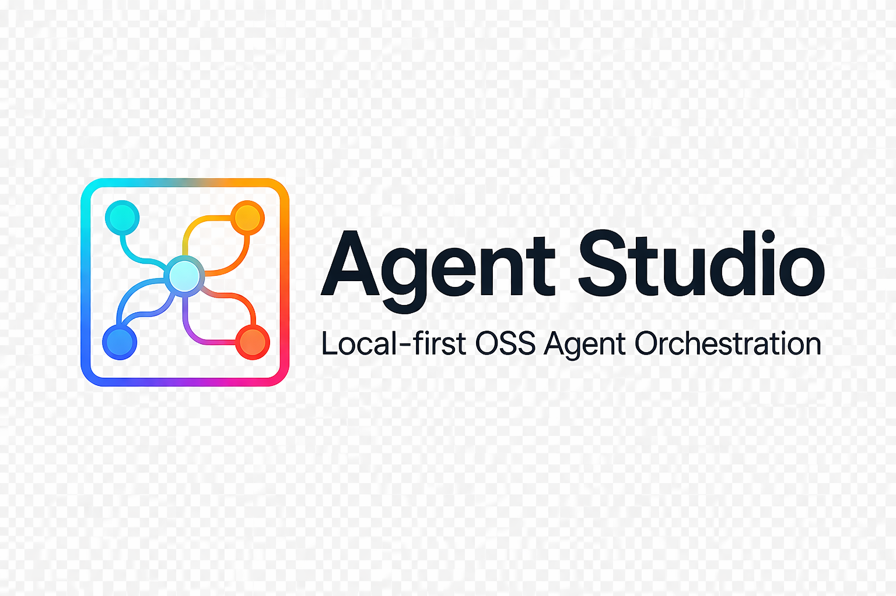
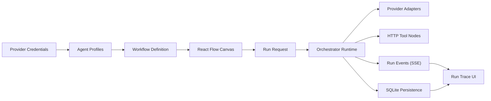
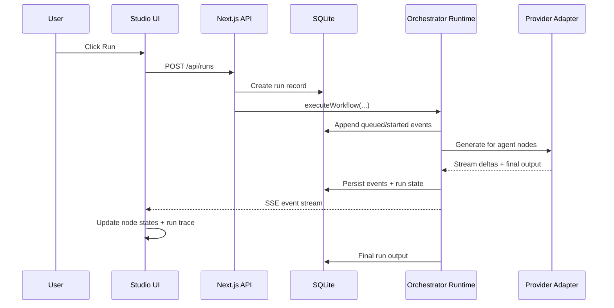
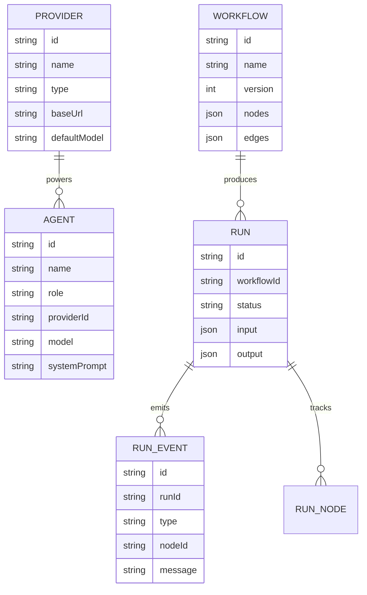

<p align="center">
  
</p>

# Local Agent Studio

Local Agent Studio is a local-first, open-source agent orchestration platform for building and running multi-agent workflows with a visual graph interface.

It combines:

- a React Flow canvas for orchestration design
- a TypeScript runtime for DAG execution
- SQLite persistence for local state
- provider abstraction for Ollama, OpenAI-compatible APIs, and OpenAI
- live run traces over SSE

The current release is focused on a practical MVP that users can run locally, configure with their own keys, and inspect end-to-end.

## Why This Exists

Most agent tooling forces one of two bad tradeoffs:

- a hosted black box with limited control over providers, prompts, and logs
- a code-only orchestration setup that is hard to inspect and harder to explain

Local Agent Studio aims for a better default:

- local-first execution
- visual orchestration
- portable workflow definitions
- provider flexibility per agent
- inspectable runtime behavior

## Core Features

- Build workflows visually with React Flow
- Create reusable agent profiles with prompts, roles, notes, tools, and model settings
- Configure providers locally and assign a different provider/model to each agent
- Support Ollama, OpenAI-compatible APIs, and OpenAI
- Run DAG-based orchestrations with live trace events
- Persist providers, agents, workflows, runs, and events in SQLite
- Import and export studio state as JSON
- Use seeded demo providers, agents, and workflow as a starting point
- Install from GitHub Releases with a single `curl ... | bash`

## Product Snapshot



## Tech Stack

### Frontend

- Next.js
- React
- TypeScript
- React Flow
- Tailwind-style utility classes
- Lucide icons

### Backend and Runtime

- Next.js route handlers
- TypeScript orchestration runtime
- SSE for live run streaming
- Zod for schema validation

### Persistence

- SQLite
- `better-sqlite3`

### Packaging and Delivery

- npm workspaces
- GitHub Actions
- GitHub Releases
- shell installer via [`install.sh`](./install.sh)

## Repository Structure

```text
.
├── apps/
│   └── web/                  # Next.js studio app
├── packages/
│   ├── orchestrator/         # DAG runtime + provider adapters
│   └── shared/               # Schemas, shared types, sample data
├── scripts/
│   └── release/              # Standalone packaging scripts
├── install.sh                # GitHub-hosted installer
└── README.md
```

## Monorepo Packages

### `apps/web`

The product UI and API surface:

- React Flow canvas
- node inspector
- provider modal
- runs/history sidebar
- API routes for providers, agents, workflows, runs, and Ollama model discovery
- local SQLite access

### `packages/shared`

Shared contracts across the system:

- provider schema
- agent schema
- workflow node and edge schema
- run record and run event schema
- studio snapshot schema

### `packages/orchestrator`

Runtime responsibilities:

- workflow DAG validation
- execution scheduling
- provider adapter resolution
- node execution
- streaming run events

## Architecture

### High-Level Runtime



### Data Model



## Workflow Model

The MVP supports the following node types:

- `input`
- `agent`
- `router`
- `http_tool`
- `output`

Workflows are DAG-only in this version. Cycles are rejected by the runtime.

### Shared Schema Example

```ts
export const workflowNodeTypeSchema = z.enum([
  "input",
  "agent",
  "router",
  "http_tool",
  "output",
]);
```

From [`packages/shared/src/schemas.ts`](./packages/shared/src/schemas.ts).

### Agent Profile Example

```ts
export const agentProfileSchema = z.object({
  id: z.string(),
  name: z.string().min(1),
  description: z.string().default(""),
  notes: z.string().default(""),
  profileType: z.string().min(1).default("general"),
  role: agentRoleSchema,
  providerId: z.string(),
  model: z.string().min(1),
  systemPrompt: z.string().default(""),
  temperature: z.number().min(0).max(2).default(0.4),
  maxTokens: z.number().int().positive().default(1200),
  outputMode: outputModeSchema.default("text"),
  allowedTools: z.array(z.string()).default([]),
});
```

## Execution Model

The runtime does four important things:

1. validates the workflow as a DAG
2. builds incoming and outgoing edge maps
3. schedules ready nodes as dependencies complete
4. emits structured run events for the UI and persistence layer

### DAG Validation Snippet

```ts
function validateDag(workflow: WorkflowDefinition) {
  const { incoming, outgoing } = buildMaps(workflow);
  const inDegree = new Map<string, number>();
  const queue: string[] = [];

  for (const node of workflow.nodes) {
    const degree = incoming.get(node.id)?.length ?? 0;
    inDegree.set(node.id, degree);
    if (degree === 0) {
      queue.push(node.id);
    }
  }

  let visited = 0;
  while (queue.length > 0) {
    const nodeId = queue.shift()!;
    visited += 1;
    for (const edge of outgoing.get(nodeId) ?? []) {
      const next = (inDegree.get(edge.target) ?? 0) - 1;
      inDegree.set(edge.target, next);
      if (next === 0) {
        queue.push(edge.target);
      }
    }
  }

  if (visited !== workflow.nodes.length) {
    throw new Error("Workflow must be a DAG for this MVP.");
  }
}
```

From [`packages/orchestrator/src/runtime.ts`](./packages/orchestrator/src/runtime.ts).

### Event Model

Run events are persisted and streamed using these event types:

- `queued`
- `started`
- `stream_delta`
- `completed`
- `failed`

That event contract lives in [`packages/shared/src/schemas.ts`](./packages/shared/src/schemas.ts).

## Local Persistence

The app uses SQLite as its local system of record. On first boot it seeds demo providers, agents, and a sample workflow.

### Database Bootstrap Snippet

```ts
db.exec(`
  CREATE TABLE IF NOT EXISTS providers (
    id TEXT PRIMARY KEY,
    json TEXT NOT NULL
  );
  CREATE TABLE IF NOT EXISTS agents (
    id TEXT PRIMARY KEY,
    json TEXT NOT NULL
  );
  CREATE TABLE IF NOT EXISTS workflows (
    id TEXT PRIMARY KEY,
    json TEXT NOT NULL
  );
  CREATE TABLE IF NOT EXISTS runs (
    id TEXT PRIMARY KEY,
    json TEXT NOT NULL
  );
  CREATE TABLE IF NOT EXISTS run_events (
    id TEXT PRIMARY KEY,
    run_id TEXT NOT NULL,
    json TEXT NOT NULL
  );
`);
```

From [`apps/web/lib/db.ts`](./apps/web/lib/db.ts).

SQLite data is stored locally at `apps/web/data/studio.db` during development.

## Provider Support

### Supported Now

- Ollama
- OpenAI
- OpenAI-compatible APIs

Featherless.ai is intentionally handled as an OpenAI-compatible provider rather than a custom forked implementation.

### Per-Agent Provider Selection

Each agent profile has:

- its own `providerId`
- its own `model`
- its own system prompt
- its own runtime parameters

That means one workflow can mix:

- a local Ollama coordinator
- a Featherless-compatible researcher
- an OpenAI developer agent

## Ollama Model Discovery

When Ollama is selected in the provider modal or agent inspector, the app can query the local Ollama-compatible endpoint and surface discovered models instead of relying on a free-text field.

## Running Locally

### Prerequisites

- Node.js 22+
- npm
- Ollama locally, if you want local models

### Install Dependencies

```bash
npm install
```

### Start the App

```bash
npm run dev
```

Open `http://localhost:3000`.

### Production Build

```bash
npm run build
```

### Tests

```bash
npm test
```

### Lint

```bash
npm run lint
```

## One-Line Install

Once release artifacts exist on GitHub Releases, users can install directly from the hosted installer:

```bash
curl -fsSL https://raw.githubusercontent.com/harishkotra/local-agent-studio/main/install.sh | bash
```

Useful commands after install:

```bash
agent-studio start
agent-studio background
agent-studio stop
agent-studio status
agent-studio logs
```

Install a specific version:

```bash
curl -fsSL https://raw.githubusercontent.com/harishkotra/local-agent-studio/main/install.sh | bash -s -- --version v0.0.1
```

Uninstall:

```bash
curl -fsSL https://raw.githubusercontent.com/harishkotra/local-agent-studio/main/install.sh | bash -s -- --uninstall
```

## Example Workflow JSON

```json
{
  "id": "workflow-demo",
  "name": "CEO Delegation Demo",
  "version": 1,
  "description": "Coordinator delegates to two workers",
  "nodes": [
    {
      "id": "node-input",
      "type": "input",
      "label": "Task Brief",
      "description": "Initial user brief",
      "position": { "x": 80, "y": 260 },
      "data": {
        "text": "Build a launch plan for {{product}}",
        "variables": ["product"]
      }
    }
  ],
  "edges": [],
  "createdAt": "2026-04-08T00:00:00.000Z",
  "updatedAt": "2026-04-08T00:00:00.000Z"
}
```

## Import and Export

The studio can export and import a full snapshot of:

- providers
- agents
- workflows

This makes the local-first setup portable and easier to share or back up.

## Contributing

### Fork and Clone

```bash
git clone https://github.com/harishkotra/local-agent-studio.git
cd local-agent-studio
npm install
```

### Create a Branch

```bash
git checkout -b las/issue-your-change
```

### Run the Project

```bash
npm run dev
```

### Before Opening a PR

```bash
npm run lint
npm test
npm run build
```

### Recommended Contribution Flow

1. Open or pick a GitHub issue.
2. Create a focused branch.
3. Make one logically grouped change.
4. Verify with lint, tests, and build.
5. Open a PR with screenshots or short recordings for UI changes.

## Good First Contribution Areas

- improve run observability and timing detail
- add workflow validation UX
- build richer HTTP tool templates
- improve import/export versioning
- add onboarding and templates
- improve node comparison and diff tooling
- add workspace management and review gates

## Roadmap Themes

Tracked in GitHub issues already:

- provider testing and normalized model discovery
- snapshots and versioning
- run controls
- workflow input variables
- graph guardrails
- local secret storage
- tool adapter SDK
- onboarding and templates
- AgentSkills compatibility
- workspace-aware orchestration
- review gates and output comparison
- kanban-style operations board