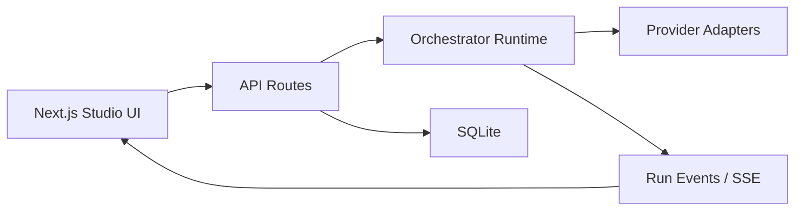

# LinkedIn Post: Local Agent Studio

I’ve just shipped `Local Agent Studio`, a local-first open-source agent orchestration app for building and running multi-agent workflows visually.

The idea behind it was straightforward: most agent tooling today is either too opaque, too hosted, or too code-only. I wanted something that developers could run on their own machine, connect to their own providers, and inspect in detail instead of treating orchestration like a black box.

What the first release includes:

- a React Flow canvas for building orchestration graphs
- reusable agent profiles with their own provider and model settings
- support for Ollama, OpenAI-compatible APIs, and OpenAI
- a TypeScript DAG runtime
- SQLite-based local persistence
- live trace events over SSE
- import/export support
- a GitHub-hosted installer flow

One of the design choices I care most about is per-agent provider flexibility. In this app, every agent can have its own provider and model. That means a coordinator can run on a local Ollama model while a worker uses an OpenAI-compatible endpoint. Users are not forced into a single-provider architecture.

Under the hood, the app is structured as:

- `apps/web` for the Next.js studio
- `packages/shared` for Zod schemas and shared contracts
- `packages/orchestrator` for runtime and provider adapters

At a high level, the architecture looks like this:



A representative runtime guardrail is DAG validation before execution:

```ts
function validateDag(workflow: WorkflowDefinition) {
  const { incoming, outgoing } = buildMaps(workflow);
  const inDegree = new Map<string, number>();
  const queue: string[] = [];

  for (const node of workflow.nodes) {
    const degree = incoming.get(node.id)?.length ?? 0;
    inDegree.set(node.id, degree);
    if (degree === 0) {
      queue.push(node.id);
    }
  }

  let visited = 0;
  while (queue.length > 0) {
    const nodeId = queue.shift()!;
    visited += 1;
    for (const edge of outgoing.get(nodeId) ?? []) {
      const next = (inDegree.get(edge.target) ?? 0) - 1;
      inDegree.set(edge.target, next);
      if (next === 0) {
        queue.push(edge.target);
      }
    }
  }

  if (visited !== workflow.nodes.length) {
    throw new Error("Workflow must be a DAG for this MVP.");
  }
}
```

The current release is intentionally an MVP, but the base is now there for:

- versioning and snapshots
- richer observability
- review gates
- workspace-aware orchestration
- AgentSkills compatibility
- operations-board style workflow monitoring

If you want to explore it or contribute:

GitHub: https://github.com/harishkotra/local-agent-studio

Built by Harish Kotra: https://harishkotra.me  
Checkout my other builds: https://dailybuild.xyz
