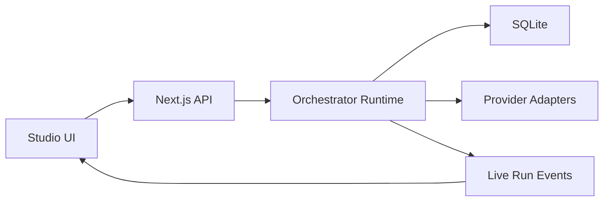

# X Thread: Local Agent Studio

## Post 1

I just shipped `Local Agent Studio`:

an open-source, local-first multi-agent orchestration app with a visual React Flow canvas.

You can run it locally, bring your own providers, and inspect every run end-to-end.

GitHub: https://github.com/harishkotra/local-agent-studio

## Post 2

What it does:

- build workflows visually
- create reusable agent profiles
- assign a different provider/model to each agent
- run DAG-based orchestrations locally
- inspect live trace events and persisted history

## Post 3

Tech stack:

- Next.js
- React Flow
- TypeScript
- SQLite
- Zod
- SSE for live run traces

It’s structured as a small monorepo:

- `apps/web`
- `packages/shared`
- `packages/orchestrator`

## Post 4

Provider support in `v0.0.1`:

- Ollama
- OpenAI
- OpenAI-compatible APIs

That means you can mix local + remote models in the same orchestration graph instead of forcing one provider for the whole app.

## Post 5

One of the decisions I cared about most:

each agent gets its own:

- provider
- model
- system prompt
- runtime settings

So a coordinator can run on Ollama while a worker uses an OpenAI-compatible endpoint.

## Post 6

The runtime is intentionally simple in this first release:

- DAG-only workflows
- input / agent / router / HTTP tool / output nodes
- queued / started / stream_delta / completed / failed events

Small enough to stay understandable. Strong enough to be useful.

## Post 7

There’s also a one-line install path:

```bash
curl -fsSL https://raw.githubusercontent.com/harishkotra/local-agent-studio/main/install.sh | bash
```

That way people don’t need to clone the repo just to try it.

## Post 8

Architecture sketch:



## Post 9

Already planning next:

- workflow versioning
- run controls
- better observability
- review gates
- workspace-aware orchestration
- AgentSkills compatibility

## Post 10

If you want to try it, fork it, or contribute:

GitHub: https://github.com/harishkotra/local-agent-studio

Built by Harish Kotra:

https://harishkotra.me

Other builds:

https://dailybuild.xyz
