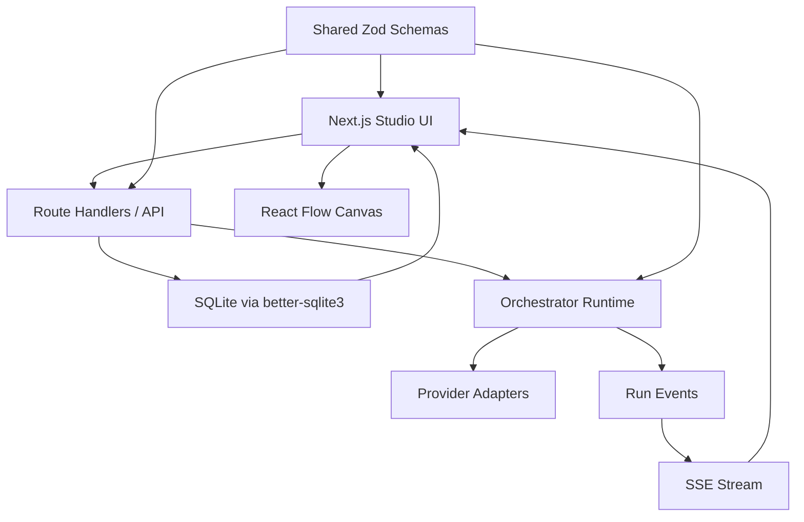
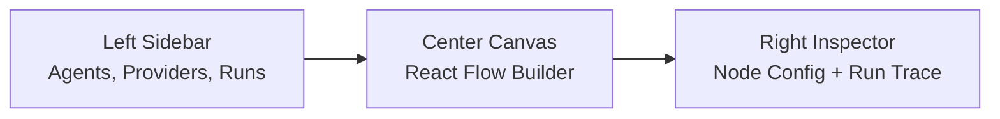

# Building Local Agent Studio: A Local-First OSS Multi-Agent Orchestration App

## Introduction

Local Agent Studio started as a practical question:

How do you build a multi-agent orchestration product that is visual, local-first, provider-flexible, and understandable by developers?

The answer we shipped in `v0.0.1` is a focused MVP:

- React Flow for the orchestration canvas
- Next.js for the application shell and API routes
- TypeScript for the runtime and shared contracts
- SQLite for local persistence
- SSE for live execution traces
- provider adapters for Ollama, OpenAI-compatible endpoints, and OpenAI

This post breaks down the architecture, the execution model, and the product choices behind the first release.

## Product Goals

The app was designed around a few non-negotiables:

1. Users should be able to run it locally.
2. Users should be able to bring their own keys and providers.
3. Each agent should be independently configurable.
4. Workflows should be visual and inspectable.
5. Runs should emit enough trace information to understand what happened.

That led to a design where the studio is both:

- a builder for workflows and agent profiles
- a runtime console for local orchestration execution

## High-Level Architecture



The key architectural decision was to keep contracts centralized. The UI, API, and runtime all share the same Zod-backed schema package so the orchestration data model does not drift.

## Why a Monorepo

The project is split into three main packages:

```text
apps/web
packages/shared
packages/orchestrator
```

This keeps responsibilities separated:

- `apps/web` owns UI, API routes, and local persistence
- `packages/shared` owns the type-safe contracts
- `packages/orchestrator` owns execution behavior

That split matters because orchestration products get brittle fast when the builder schema, database payloads, and runtime assumptions diverge.

## The Shared Contract Layer

The shared schema package defines:

- providers
- agent profiles
- workflow nodes and edges
- run events
- run records
- export/import snapshot shape

Here is a representative piece of the contract:

```ts
export const providerTypeSchema = z.enum([
  "ollama",
  "openai",
  "openai_compatible",
]);
```

And the workflow node union:

```ts
export const workflowNodeSchema = z.discriminatedUnion("type", [
  inputNodeSchema,
  agentNodeSchema,
  routerNodeSchema,
  httpToolNodeSchema,
  outputNodeSchema,
]);
```

This gives the whole stack a single source of truth. If a node or provider changes shape, everything that depends on it gets type pressure immediately.

## Why React Flow

React Flow is a strong fit for this class of product because it already solves:

- draggable node layout
- handles and edges
- view controls and panels
- custom node rendering
- viewport state

That let us spend time on domain concerns instead of rebuilding graph primitives from scratch.

In the MVP, the canvas supports:

- custom agent cards
- graph editing
- connection creation
- theme-aware rendering
- lock and viewport controls
- inspector-driven node configuration

## Agent Model

One of the core product decisions was that each agent profile should carry its own provider and model selection.

That means the system is not tied to a single workspace-wide model choice.

An agent profile includes:

- role
- provider
- model
- system prompt
- profile type
- notes
- allowed tools
- generation settings

Example:

```ts
export const agentProfileSchema = z.object({
  id: z.string(),
  name: z.string().min(1),
  description: z.string().default(""),
  notes: z.string().default(""),
  profileType: z.string().min(1).default("general"),
  role: agentRoleSchema,
  providerId: z.string(),
  model: z.string().min(1),
  systemPrompt: z.string().default(""),
  temperature: z.number().min(0).max(2).default(0.4),
  maxTokens: z.number().int().positive().default(1200),
});
```

That design makes mixed-provider graphs straightforward. A coordinator can run on local Ollama while a worker uses a remote OpenAI-compatible model.

## Provider Abstraction

The provider layer uses a common adapter interface so the runtime does not care whether the backing model is:

- local Ollama
- OpenAI
- a third-party OpenAI-compatible endpoint

That abstraction is the difference between a flexible orchestration platform and a model-specific app.

Featherless.ai was intentionally modeled as OpenAI-compatible instead of a custom provider branch. That avoids provider sprawl and keeps the system extensible.

## Runtime Design

The orchestration runtime has a small, explicit responsibility set:

1. validate the workflow
2. build dependency maps
3. execute nodes in dependency-safe order
4. stream lifecycle events
5. persist run state

The first important runtime guardrail is DAG validation:

```ts
function validateDag(workflow: WorkflowDefinition) {
  const { incoming, outgoing } = buildMaps(workflow);
  const inDegree = new Map<string, number>();
  const queue: string[] = [];

  for (const node of workflow.nodes) {
    const degree = incoming.get(node.id)?.length ?? 0;
    inDegree.set(node.id, degree);
    if (degree === 0) {
      queue.push(node.id);
    }
  }

  let visited = 0;
  while (queue.length > 0) {
    const nodeId = queue.shift()!;
    visited += 1;
    for (const edge of outgoing.get(nodeId) ?? []) {
      const next = (inDegree.get(edge.target) ?? 0) - 1;
      inDegree.set(edge.target, next);
      if (next === 0) {
        queue.push(edge.target);
      }
    }
  }

  if (visited !== workflow.nodes.length) {
    throw new Error("Workflow must be a DAG for this MVP.");
  }
}
```

For an MVP, DAG-only execution is the right constraint. Cycles, resumable long-running jobs, and schedulers all complicate failure handling and state recovery.

## Node Execution

The runtime supports these node types:

- `input`
- `agent`
- `router`
- `http_tool`
- `output`

Each type maps to a different execution path:

- `input` resolves templated user input
- `agent` calls an LLM provider adapter
- `router` picks the next logical route from structured output
- `http_tool` calls external HTTP endpoints
- `output` materializes a final output

For agent nodes, the runtime composes:

- the node prompt
- workflow inputs
- upstream node outputs
- the agent system prompt

That gives each node enough context to behave like a stage in a larger orchestration rather than a standalone chat call.

## Streaming and Traces

One of the biggest UX wins in orchestration products is showing execution as it happens.

The app emits structured events:

- `queued`
- `started`
- `stream_delta`
- `completed`
- `failed`

Those are persisted and streamed over SSE to the UI. The benefit is immediate:

- nodes can glow or update status live
- users can inspect progress before completion
- failures are easier to localize
- run history survives refresh and restart

## Persistence Strategy

The app uses SQLite with JSON payload tables rather than over-modeling the schema too early.

That is a pragmatic MVP tradeoff:

- faster iteration on contracts
- easy local setup
- fewer migration concerns in the first release

The database bootstrap is deliberately simple:

```ts
db.exec(`
  CREATE TABLE IF NOT EXISTS providers (
    id TEXT PRIMARY KEY,
    json TEXT NOT NULL
  );
  CREATE TABLE IF NOT EXISTS agents (
    id TEXT PRIMARY KEY,
    json TEXT NOT NULL
  );
  CREATE TABLE IF NOT EXISTS workflows (
    id TEXT PRIMARY KEY,
    json TEXT NOT NULL
  );
  CREATE TABLE IF NOT EXISTS runs (
    id TEXT PRIMARY KEY,
    json TEXT NOT NULL
  );
  CREATE TABLE IF NOT EXISTS run_events (
    id TEXT PRIMARY KEY,
    run_id TEXT NOT NULL,
    json TEXT NOT NULL
  );
`);
```

That said, the roadmap already includes schema-versioned export/import and snapshots, because long-term portability needs more deliberate version control.

## UI Structure

The product shell is organized around three zones:



This division works because each zone answers a different user question:

- left: what assets do I have?
- center: how does the workflow connect?
- right: what is selected and what happened during execution?

## Theme and Interaction Choices

The MVP supports both dark and light mode. That is more than aesthetic polish. Many orchestration tools default to dark-only interfaces even when users spend hours inside them.

The product also improved graph usability with:

- clearer connection affordances
- lockable grid behavior
- model pickers in the right contexts
- Ollama model discovery
- explicit provider edit modal

## Installation Strategy

We also built a GitHub Releases-based installer.

Instead of forcing users to clone the repo, the product can be distributed through:

```bash
curl -fsSL https://raw.githubusercontent.com/harishkotra/local-agent-studio/main/install.sh | bash
```

The installer is designed to:

- detect OS and architecture
- download a versioned release asset
- verify checksums
- install into a user-local directory
- expose a launcher command

That matters because onboarding friction is often the difference between “interesting OSS project” and “thing people actually try.”

## Why Local-First Matters

This architecture is not local-first as a branding slogan. It changes system design in concrete ways:

- provider keys are local
- SQLite is local
- workflows can be exported and imported
- Ollama is a first-class provider
- hosted infrastructure is optional rather than mandatory

That makes the product attractive for:

- developers experimenting with orchestration
- privacy-sensitive users
- teams that want to self-host or fork
- builders who prefer infrastructure they can inspect

## Roadmap Directions

Several next steps are already tracked in GitHub issues:

- run observability
- snapshots and versioning
- workflow inputs
- validation guardrails
- AgentSkills compatibility
- workspace-aware orchestration
- review gates
- output diffing
- kanban-style operations board

Those issues are valuable because they turn product intuition into implementation-ready work items.

## Lessons From the Build

A few things stand out after shipping the first release:

### 1. Shared contracts reduce chaos

The Zod schema layer keeps the UI, database, and runtime aligned.

### 2. Visual orchestration only works if traces are strong

A graph alone is not enough. Users need live node state and persisted event history.

### 3. Provider flexibility has to exist at the agent level

Anything less becomes a bottleneck almost immediately.

### 4. Local-first products still need distribution polish

The installer and release flow are not optional extras. They are part of adoption.

## Closing

Local Agent Studio is still early, but the foundation is now in place:

- visual workflow builder
- provider-flexible agents
- local persistence
- DAG execution runtime
- live traces
- one-line install path

That makes it a useful base for both users and contributors.

Built by [Harish Kotra](https://harishkotra.me). More builds at [dailybuild.xyz](https://dailybuild.xyz).
